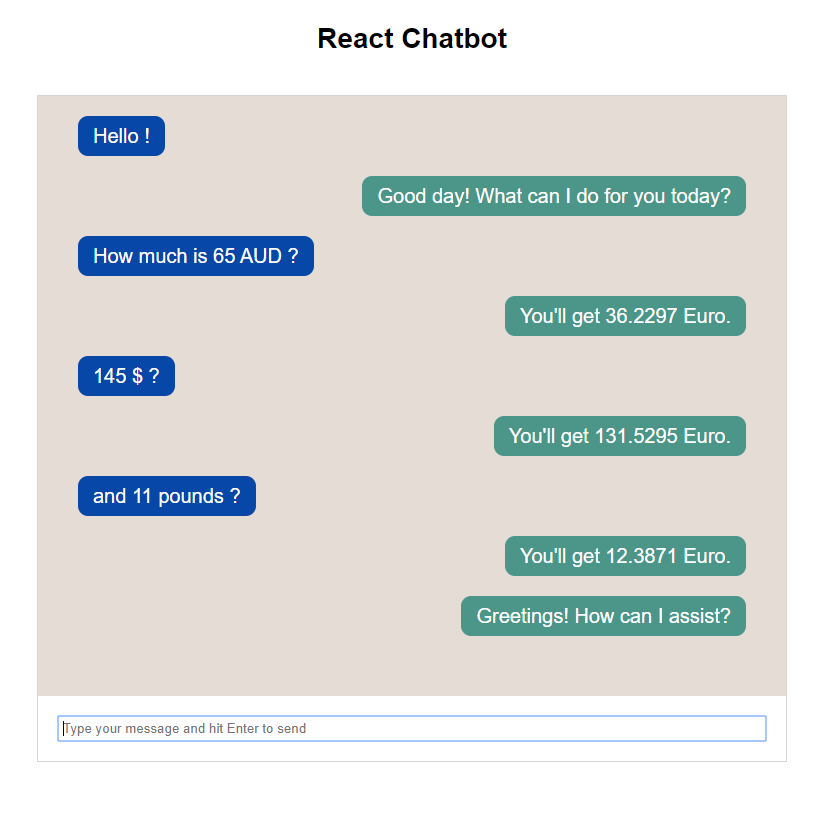

# CHATBOTS AND RECOMMENDATION SYSTEMS
## Final Project

### CHATBOT FUNCTIONALITIES

The chatbot created is meant to convert the amount of money typed in the chatbar into Euro. The project architecture mainly relies on a nodejs/ express server, a react frontend and dialogflow as a recommender system.
For the system to work, I used the API from : https://www.alphavantage.co/.

### RUN PROJECT

To run the chatbot, you should proceed the following way : 

```bash
$ node server
$ cd react-bot
$ yarn start
```

Then, you can test the Bot on http://localhost:3000.
Below, you will find the type of statements understood by the chatbot as well as its answers. The conversation flow has been set using Dialogflow.

